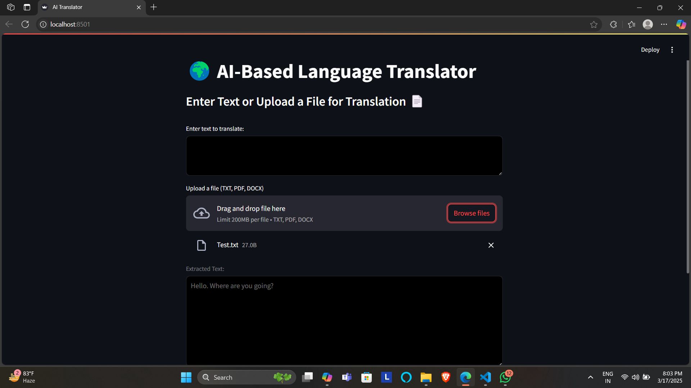
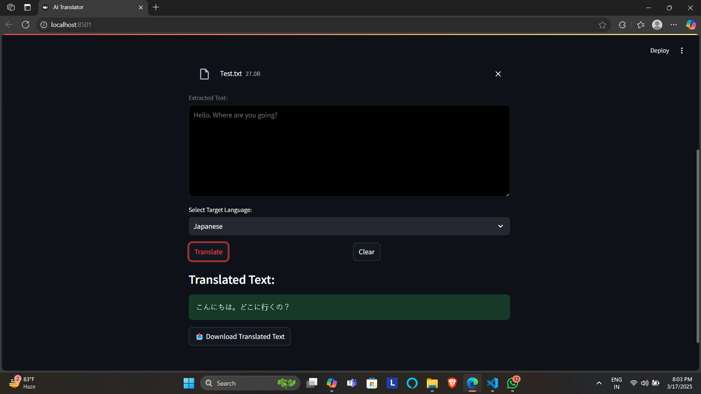

🌍 AI-Based Language Translator

This project is an AI-powered language translator that allows users to type or upload a file in one language and translate it into another. It supports multiple languages and provides document translation for ease of use.

---

✨ Features

✔ Translate text between 20+ languages
✔ Upload TXT/DOCX files for translation 📄
✔ FastAPI Backend for Processing
✔ Simple, Responsive UI using Streamlit
✔ Deployed on Streamlit Cloud ☁
✔ Download translated files 📥

---

## 🖥 Live Demo

🔗 _Try it here:_ [AI-Based Language Translator](https://ai-language-translator-gmknsdinptzxxeycfyhevv.streamlit.app/)

---

## 🚀 Installation Guide

Follow these steps to set up the project _locally_:

### 1️⃣ _Clone the Repository_

bash
git clone [Repository](https://github.com/ANIRUDDH-EKANSH-PANDEY/AI-Language-Translator.git)
cd AI_Translator_Project

2️⃣ Create & Activate a Virtual Environment

# Windows

python -m venv translator_env
translator_env\Scripts\activate

# Mac/Linux

python -m venv translator_env
source translator_env/bin/activate

3️⃣ Install Dependencies

pip install -r requirements.txt

4️⃣ Run the Backend (FastAPI Server)

uvicorn backend:app --reload

5️⃣ Run the Frontend (Streamlit UI)

streamlit run frontend.py

---

## 📌 Technologies Used

✔ Python 🐍 – Core Programming Language
✔ Streamlit 🎨 – Frontend UI Framework
✔ FastAPI ⚡ – Backend API
✔ Deep Translator 🌎 – Language Translation Engine
✔ Uvicorn 🚀 – ASGI Server for FastAPI
✔ python-docx 📝 – Extract Text from DOCX
✔ Requests 🔗 – Handle API Requests

---

## 🖼 Screenshots

### 1️⃣ Home Page

### 2️⃣ Translation Result

---

🚀 Deployment on Streamlit Cloud

This project is deployed on Streamlit Cloud.

Steps to Deploy on Streamlit:

1. Push your project to GitHub.

2. Go to Streamlit Cloud and log in.

3. Click "Deploy" and select your GitHub repository.

4. Set frontend.py as the entry point.

5. Click "Deploy", and Streamlit will handle the rest!

🔗 Live Deployment: Your Streamlit App URL (Replace this with the actual URL)

---

🎯 Future Improvements

✅ Add real-time speech translation

✅ Support more languages

✅ Improve UI and theme customization

✅ Implement offline translation mode

---

🤝 Contribution Guidelines

Contributions are welcome! Feel free to:
✅ Fork the repository
✅ Submit issues
✅ Create pull requests

1. Fork this repository.

2. Create a new branch:

git checkout -b feature-branch

3. Make your changes & commit:

git commit -m "Added new feature"

4. Push to GitHub & create a Pull Request:

git push origin feature-branch

---

📜 License

This project is open-source and free to use under the MIT License.

---

👨‍💻 Author

💡 Aniruddh Ekansh Pandey

## 📞 Contact

📧 _Email:_ [pandeyaniruddhekansh@gmail.com](mailto:pandeyaniruddhekansh@gmail.com)  
🔗 _LinkedIn:_ [Aniruddh Ekansh Pandey](https://www.linkedin.com/in/aniruddh-ekansh-pandey-447904258)

---

Made with ❤ using Python & Streamlit 🚀

---
