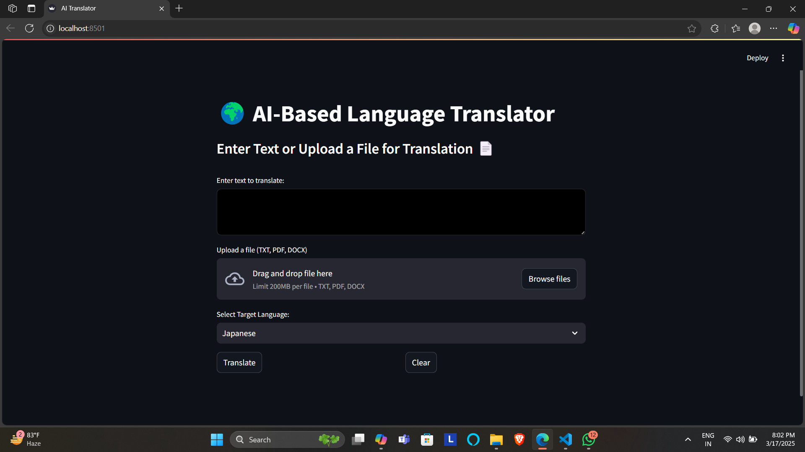

# 🌍 AI-Based Language Translator

This project is an _AI-powered language translator_ that allows users to _type or speak_ in one language and translate it into another. It supports _multiple languages_ and provides _speech-to-text functionality_ for hands-free translation.

## ✨ Features

✔ _Translate text between 20+ languages_  
✔ _Speech-to-Text (Microphone Input)_ 🎙 
✔ _FastAPI Backend for Processing_  
✔ _Simple, Responsive UI using Streamlit_  
✔ _Deployed on Streamlit Cloud_ ☁

---

## 🖥 Live Demo

🔗 _Try it here:_ [Your Streamlit App URL](#) (Replace this with your deployed app link)

---

## 🚀 Installation Guide

Follow these steps to set up the project _locally_:

### 1️⃣ _Clone the Repository_

bash
git clone [<Repo-url>](https://github.com/ANIRUDDH-EKANSH-PANDEY/AI-Language-Translator.git)
cd AI_Translator_Project

2️⃣ Create & Activate a Virtual Environment

# Windows

python -m venv translator_env
translator_env\Scripts\activate

# Mac/Linux

python -m venv translator_env
source translator_env/bin/activate

3️⃣ Install Dependencies

pip install -r requirements.txt

4️⃣ Run the Backend (FastAPI Server)

uvicorn backend:app --reload

5️⃣ Run the Frontend (Streamlit UI)

streamlit run frontend.py

---

## 📌 Technologies Used

| Technology                | Purpose                   |
| ------------------------- | ------------------------- |
| _Python_ 🐍               | Core Programming Language |
| _Streamlit_ 🎨            | Frontend UI Framework     |
| _SpeechRecognition_ 🎙     | Microphone Input          |
| _FastAPI_ ⚡              | Backend API               |
| _Google Translate API_ 🌎 | Translation Engine        |
| _Uvicorn_ 🚀              | ASGI Server for FastAPI   |

---

## 🖼 Screenshots

### 1️⃣ Home Page

### 2️⃣ Translation Result

---

🚀 Deployment on Streamlit Cloud

This project is deployed on Streamlit Cloud.

Steps to Deploy on Streamlit:

1. Push your project to GitHub.

2. Go to Streamlit Cloud and log in.

3. Click "Deploy" and select your GitHub repository.

4. Set frontend.py as the entry point.

5. Click "Deploy", and Streamlit will handle the rest!

🔗 Live Deployment: Your Streamlit App URL (Replace this with the actual URL)

---

🎯 Future Improvements

✅ Add real-time speech translation

✅ Support more languages

✅ Improve UI and theme customization

✅ Implement offline translation mode

---

🤝 Contribution Guidelines

Contributions are welcome! Feel free to:
✅ Fork the repository
✅ Submit issues
✅ Create pull requests

1. Fork this repository.

2. Create a new branch:

git checkout -b feature-branch

3. Make your changes & commit:

git commit -m "Added new feature"

4. Push to GitHub & create a Pull Request:

git push origin feature-branch

---

📜 License

This project is open-source and free to use under the MIT License.

---

👨‍💻 Author

💡 Aniruddh Ekansh Pandey

## 📞 Contact

📧 _Email:_ [pandeyaniruddhekansh@gmail.com](mailto:pandeyaniruddhekansh@gmail.com)  
🔗 _LinkedIn:_ [Aniruddh Ekansh Pandey](https://www.linkedin.com/in/aniruddh-ekansh-pandey-447904258)

---

Made with ❤ using Python & Streamlit 🚀

---
